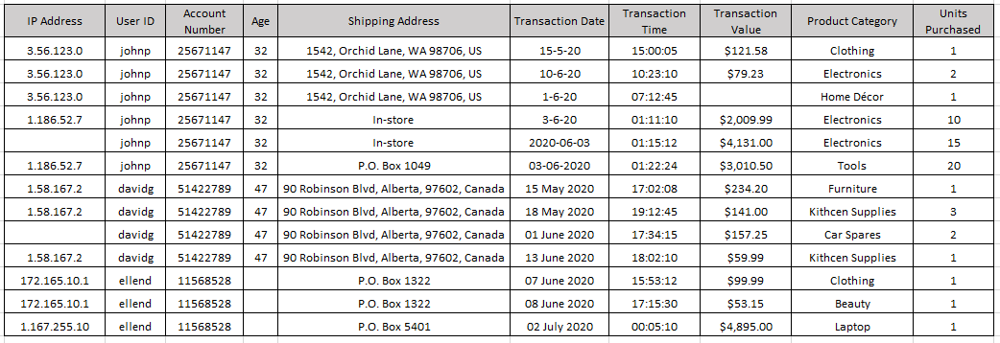
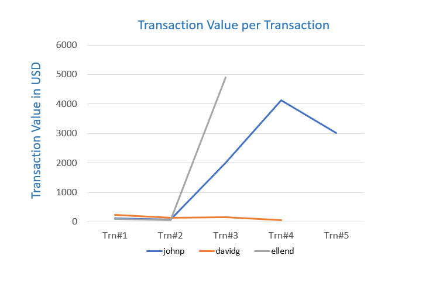

# Credit Card Fraud Analysis

## Q.1. List 5 data points that are required for the analysis and detection of a credit card fraud.
1. Transaction Amount – Helps identify unusually large or small purchases.
2.	Timestamp (Date & Time) – Detects unusual transaction times or rapid repeated transactions.
3.	IP Address & Geolocation – Flags mismatches with the cardholder’s usual location.
4.	Billing and Shipping Address – Helps spot sudden or suspicious address changes.
5.	Device Information (Device ID, Browser, OS) – Detects logins or transactions from new or unfamiliar devices.

## Q. 2. Refer to the data table below and identify 3 errors/issues that could impact the accuracy of your findings.

 
 
1.	Multiple Transactions from the Same User in a Short Time (Abnormal Frequency) - 	User johnp made multiple transactions (e.g., on 1-6-20, 3-6-20, and 10-6-20) in close succession, with significantly high values—some within minutes. This unusual frequency and value spike should be flagged for review.

2.	Inconsistent Shipping Addresses for the Same User - 	For johnp, the shipping address changes from a full home address to "In-store" and then to "P.O. Box 1049". Such sudden changes in delivery preferences may indicate possible fraud or account misuse.

3.	Same IP Address with Multiple Transactions in Different Categories and Amounts - User davidg made four transactions from the same IP address (1.58.167.2) with different product categories and varying values within a short timeframe, which might be a bot or automated abuse pattern.

## Q.3. Refer to the data table below and identify 2 anomalies or unexpected behaviours, that would lead you to believe the transaction may be suspect.

 
 
1.  Unusually High-Value Transactions with Rapid Delivery Preference Changes (User: johnp) :  On 03-06-2020, user johnp made a transaction worth $4,131.00 and immediately afterward another one worth $3,010.50, both from different delivery methods ("In-store" and "P.O. Box 1049").
This sudden change in delivery preference combined with high-value purchases within minutes is highly irregular and may suggest account takeover or fraudulent behavior.
2. Multiple High-Volume Purchases from Same User and IP in Short Time (User: davidg) :  User davidg made four transactions from the same IP address (1.58.167.2) within less than a month, purchasing unrelated product categories like furniture, kitchen supplies, and car spares. 
The behavior is inconsistent with regular shopping patterns and may point to automated fraud or testing stolen card details.

## Q.4. Briefly explain your key take-away from the provided data visualization chart.

 
 
The chart clearly shows that johnp and ellend have unusually high transaction values compared to davidg, whose transactions remain low and consistent. Specifically:

•	johnp exhibits a sharp spike around Trn#3 and Trn#4 (above $4,000), indicating potential fraudulent activity or abnormal behavior.

•	ellend also has a dramatic increase at Trn#3, reaching nearly $5,000, which is inconsistent with earlier low-value transactions—another red flag.

•	In contrast, davidg shows stable and low-value transactions, suggesting typical user behavior.
This visual highlights suspicious spikes in spending that should be further investigated for possible credit card fraud.
